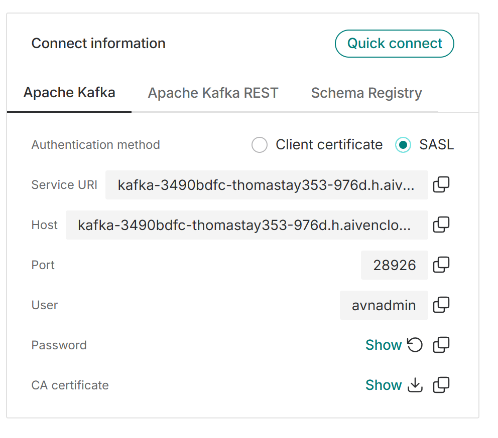

# Kafka Broker Demo using Aiven

This repository demonstrates how to connect to an Aiven-managed Kafka broker using SASL authentication.

## Overview

- Uses Aiven Portal credentials and connection details.
- Configures Kafka client access with SASL.
- Includes instructions for downloading the Aiven CA certificate and trusting it in Spark.

## Prerequisites

- An active Aiven Kafka service.
- Access to the Aiven Portal for service credentials and certificates.
- A Spark environment configured to trust the Aiven CA certificate.

## Setup Notes

### Producer and Kafka Consumer Setup
- Retrieve broker connection details and service credentials from the Aiven Portal.



- Download the Aiven CA certificate and import it into a Java keystore/truststore so Spark and other JVM clients can trust the broker.
- The import code is in notebook 3.

Credential example

```yml
AIVEN_USERNAME=user_name
AIVEN_PASSWORD=password
AIVEN_HOST=hostname
AIVEN_PORT=port_number
KEY_STORE_PASSWORD=key_store_password
```

Please copy `.env.example` to `.env` and copy the credentials to teh dotenv file.

### Spark Setup
- Spark runs on the JVM, so it cannot use the same Python SSL context directly.
- Convert the downloaded Aiven CA certificate into a Java truststore using `keytool`.
- The notebook contains the exact command for creating the truststore.
- Remove any temporary keystore/truststore files when you are finished.

## Notes

- Make sure the truststore is correctly configured before starting Spark.
- Keep service credentials secure and do not commit them to source control.


