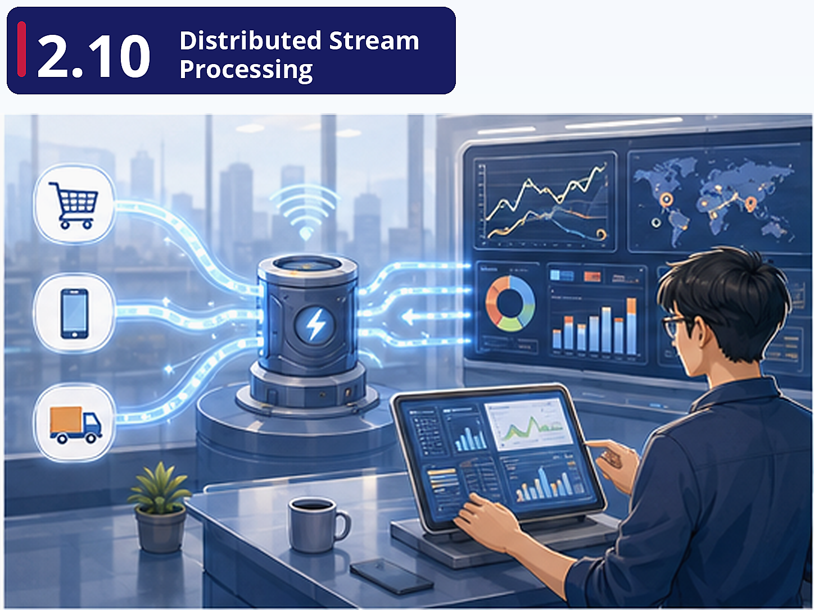

# Pre-class brief

## Where are we?

FreshCart's delivery team needs real-time visibility. When a rider picks up an order, the customer should see a live tracking update *within seconds*, not after the next hourly batch run. The fraud detection team needs to flag suspicious transactions *as they happen*, not in tomorrow's report. You need to move from batch processing (process yesterday's data today) to stream processing (process data as it arrives).

## Why this matters

Stream processing is the frontier of data engineering. While batch processing handles the majority of analytical workloads, an increasing number of use cases demand real-time or near-real-time data. Understanding Kafka and Spark Structured Streaming completes your toolkit. It also closes the conceptual loop with **Lesson 2.2**'s Lambda/Kappa architectures — now you understand *both* sides.

## Key concepts

**Apache Kafka** — The backbone of real-time data architectures. Producers write events (e.g., "order placed") to topics. Consumers read events from topics. Offsets track what's been read. For FreshCart, every order, delivery update, and payment event would be published to Kafka topics, creating a single durable event log that multiple teams can consume independently.

**Spark Structured Streaming** — The mental model is powerful: a data stream is just a table that never stops growing. Each new event appends a row. Spark processes this table in micro-batches, applying the same DataFrame API from **Lesson 2.9**. Your batch skills transfer directly to streaming.

**Connecting Batch and Stream** — This unit closes the loop on the entire module. The data engineering lifecycle (**Lesson 2.1**) has both batch and streaming paths. Lambda architecture (**Lesson 2.2**) runs both in parallel. Kafka feeds both paths. Understanding when to use batch vs stream — and how to unify them — is the architectural judgment that distinguishes a senior data engineer from a junior one.